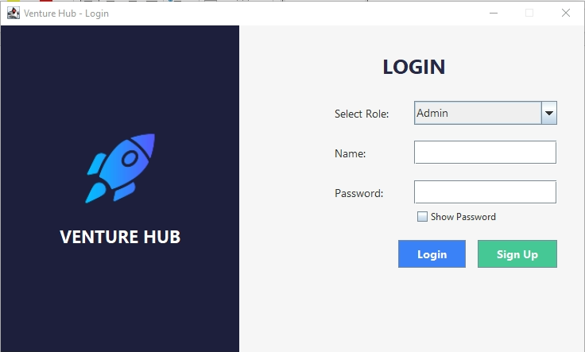

# 🚀 Venture Hub – Startup Ecosystem Desktop Application

 

## 📌 Overview
**Venture Hub** is a Java-based desktop application that simulates a collaborative ecosystem for **startup founders, mentors, and investors**. Developed as part of our Object-Oriented Programming (OOP) semester project, the platform demonstrates real-world functionality using **Java Swing for UI** and **MySQL for data management**.

---

## 🧠 Key Features

- 🔐 **Role-Based Login**  
  Founder, Mentor, and Investor roles with dedicated dashboards.

- 🏗️ **Startup Registration**  
  Founders can register startups and manage their profiles.

- 👥 **Team & Services Management**  
  Add, delete, print team members and services (with real-time updates).

- 💸 **Investor Dashboard**  
  View startups, invest in them, and visualize growth using graphs.

- 🎓 **Mentor Hiring System**  
  Founders can hire mentors, and mentors can see startups they've been hired by.

- 📊 **ProgressBar Insights**  
  Real-time growth Bar displayed after investments.

---

## 💻 Technologies Used

| Tech | Description |
|------|-------------|
| Java | Core language (Java SE) |
| Java Swing | GUI Development |
| MySQL | Database Management |
| JDBC | Java Database Connectivity |
| OOP | Inheritance, Encapsulation, Polymorphism |
| DAO Pattern | Clean database access structure |

---

## 📸 Screenshots

### 🖥️ Login Screen

### 🏢 Startup Dashboard

### 💸 Investor Panel with Growth Graph

### 👨‍🏫 Mentor Hiring Interface

---
